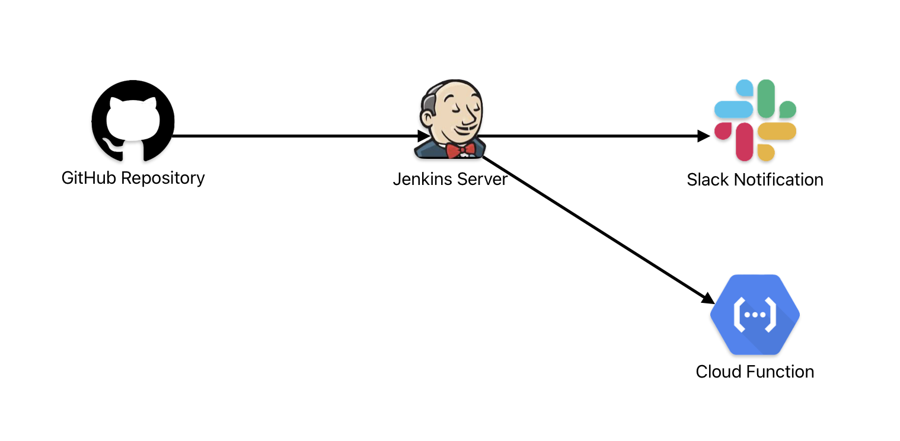

# node-js-jenkins
This repository is a beginner-friendly implementation of CI/CD Pipeline using Jenkins. This guide will teach you how to setup GitHub repository for Jenkins commits pooling, some notification integrations and lightweight deployment.

### 🧱 System Architecture
